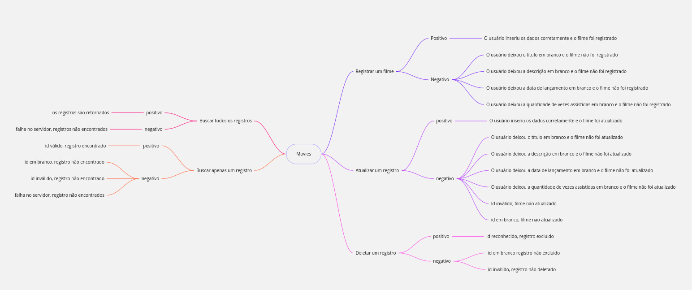
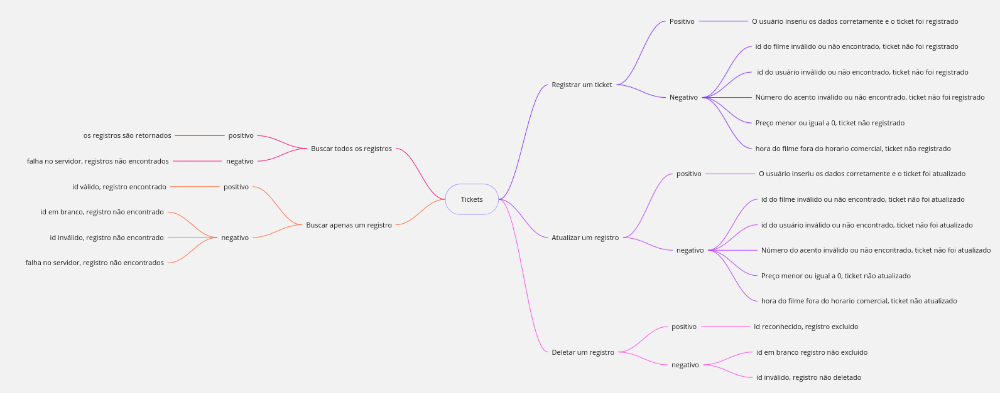

# Compass Pb Quality Assurance 
## Sobre mim
Olá, meu nome é Jean Victor de Azevedo Hefler, tenho 20 anos e estou cursando ciência da computação na Atitus (Passo Fundo), atualmente no 5° semestre do curso, gosto de teoria computacional, programação e física. Estou finalizando o programa de bolsas da **CompassUol**, no qual aprendi muito sobre a área de QA e sua importância.

## Sumário
- **[Introdução](#introdução)**
- **[Sobre a API](#sobre-a-api)**
- **[Cenários](#cenários)**
- **[Planejamento funcional](#planejamento-funcional)**
- **[Planejamento não funcional](#planejamento-não-funcional)**

## Introdução
Esse repositório contém o projeto da sprint 8 do programa de bolsas de Quality Assurance da compass Uol, onde eu utilizei o conhecimento adquirido durante o programa de bolsas, para o desenvolvimento de testes de performance na API [Cinema](https://github.com/juniorschmitz/nestjs-cinema).

## Sobre a API
### Informações Gerais
- Nome: Cinema
- UrlBase: localhost:3000 

### Endpoints e Requests
ENDPOINT: `/movies`

- HTTP Request: `GET`
- URL: urlBase/movies
- Descrição: Busca dados dos filmes registrados
___
- HTTP Request: `POST`
- URL: urlBase/movies
- Descrição: Registra um novo filme
___
- HTTP Request: `GET`
- URL: urlBase/movies/{id}
- Descrição: Busca dados de um filme registrado
___
- HTTP Request: `PUT`
- URL: urlBase/movies
- Descrição: Atualiza os dados de um filme registrado
___
- HTTP Request: `DELETE`
- URL: urlBase/movies/{id}
- Descrição: Deleta o registro de um filme
___
ENDPOINT: `/tickets`
- HTTP Request: `GET`
- URL: urlBase/tickets
- Descrição: Busca dados dos tickets registrados
___
- HTTP Request: `POST`
- URL: urlBase/tickets
- Descrição: Registra um novo ticket
___
- HTTP Request: `GET`
- URL: urlBase/tickets/{id}
- Descrição: Busca dados de um ticket registrado
___
- HTTP Request: `PUT`
- URL: urlBase/tickets/{id}
- Descrição: Atualiza os dados de um ticket registrado
___
- HTTP Request: `DELETE`
- URL: urlBase/tickets/{id}
- Descrição: Deleta o registro de um tickets
___

### Requisitos funcionais
Todos os metodos HTTP devem funcionar corretamente, retornando o status code http esperado na sua documentação, e respostas esperadas após a execusão da requisição. 

### Requisitos não funcionais
- A API deve ser capaz de processar pelo menos 10 
solicitações de criação de filmes por segundo.
- O tempo médio de resposta para a criação de um novo filme  não deve exceder 200 milissegundos.
- A API deve ser capaz de responder a solicitações GET de    listagem de filmes em menos de 100 milissegundos.
- A lista de filmes deve ser paginada, com no máximo 20 filmes por página.
- A API deve ser capaz de responder a solicitações GET de detalhes de um filme em menos de 50 milissegundos.
- A API deve ser capaz de processar pelo menos 50 solicitações de atualização de filmes por segundo.
- O tempo médio de resposta para a atualização dos detalhes de um filme não deve exceder 300 milissegundos.
- A API deve ser capaz de processar pelo menos 30 solicitações de exclusão de filmes por segundo.
- O tempo médio de resposta para a exclusão de um filme não deve exceder 400 milissegundos.
- A API deve ser capaz de processar pelo menos 50 solicitações de reserva de ingressos por segundo.
- O tempo médio de resposta para a reserva de um ingresso não deve exceder 300 milissegundos.

## Cenários
Movies, cenários positivos e negativos

Tickets, cenários positivos e negativos

## Planejamento funcional
### Introdução
com o objetivo de validar se as funcionalidades estão funcionando como esperado, serão conduzidos testes funcionais na API Cinema seguindo sua documetação, sendo eles, teste positivo, teste negativo e smoke test, para isso, será utilizado a ferramenta postman.

### Requisitos
#### **Postman**
O postman é utilizado para realizar os testes funcionais, pode ser instalado pelo [site](https://www.postman.com/downloads/) oficial do postman.

#### **API**
pode ser executada em um ambiente local com o npm, instale o npm utilizando o comando `npm install`.
Clone o [repositório](https://github.com/juniorschmitz/nestjs-cinema) da api e na pasta raiz do repositório execute o comando `npm run start`.

Para executar com Docker, é necessário utilizar o docker build para criar uma imagem da api. Para isso, Baixe o arquivo "Dockerfile" desse repositório, copie e cole na pasta raiz do diretório da API, depois execute o comando `docker build -t cinema .` que ira criar uma imagem docker da api com o nome "cinema"

### Itens a serem testados
- Movies: `/movies`
- Ticket: `/tickets`

### Cenários a serem testados
**Movies**
- Registrar um filme
- Atualizar um registro
- Buscar todos os registros
- Buscar um registo
- Deletar um registro

**Tickets**
- Registrar um ticket
- Atualizar um ticket
- Buscar todos os tickets
- Buscar um ticket
- Deletar um ticket

### Estratégia de testes
- Teste positivo -  Serão feitos testes positivos para garantir que as funcionalidades estão reagindo como esperado.

- Teste negativo - Serão feitos testes negativos com o objetivo de validar o tratamento de erro e analisar como a api reage a uma ação inesperada.

## Planejamento não funcional
### Introdução
Seguindo sua documentação, serão realizados testes de performance na API cinema, com o objetivo de validar se o desempenho da API está dentro das métricas esperadas. Para isso será utilizado a ferramenta K6.

### Requisitos
#### K6
O K6 será utilizado para realizar os testes de performance, o K6 pode ser instalado seguindo sua [Documentação](https://grafana.com/docs/k6/latest/set-up/install-k6/?pg=get&plcmt=selfmanaged-box10-cta1) oficial.

#### **API**
pode ser executada em um ambiente local com o npm, instale o npm utilizando o comando `npm install`.
Clone o [repositório](https://github.com/juniorschmitz/nestjs-cinema) da api e na pasta raiz do repositório execute o comando `npm run start`.

Para executar com Docker, é necessário utilizar o docker build para criar uma imagem da api. Para isso, Baixe o arquivo "Dockerfile" desse repositório, copie e cole na pasta raiz do diretório da API, depois execute o comando `docker build -t cinema .` que ira criar uma imagem docker da api com o nome "cinema"
### Itens a serem testados
- Movies: `/movies`
- Ticket: `/tickets`

### Cenários a serem testados
**Movies**
- Registrar um filme
- Atualizar um registro
- Buscar todos os registros
- Buscar um registo
- Deletar um registro

**Tickets**
- Registrar um ticket
- Atualizar um ticket
- Buscar todos os tickets
- Buscar um ticket
- Deletar um ticket
### Estratégia de testes
Serão conduzidos testes de Performance com o objetivo de validar os requisitos não funcionais da api seguindo os critérios formulados no repositório da api. Sendo eles, teste de resistencia, teste de carga, teste de volume, teste de carga
#### Movies
- POST - Será realizado um teste de resistência com o objetivo de validar as métricas esperadas no cadastro de filmes com valores acima do esperado.

- GET - Será realizado um teste de carga com o objetico de validar as métricas esperadas na busca de filmes.

- PUT - Será realizado um teste de volume com o objetivo de validar as métricas esperadas na atualização com um volume grande de dados

- DELETE - Será realizado um teste de carga com o objetico de validar as métricas esperadas na exclusão de filmes.
#### Tickets
- POST - Será realizado um teste de resistência com o objetivo de validar as métricas esperadas durante a reserva de ingressos